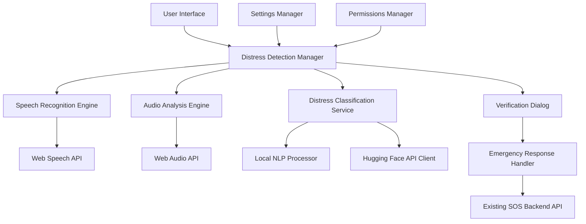
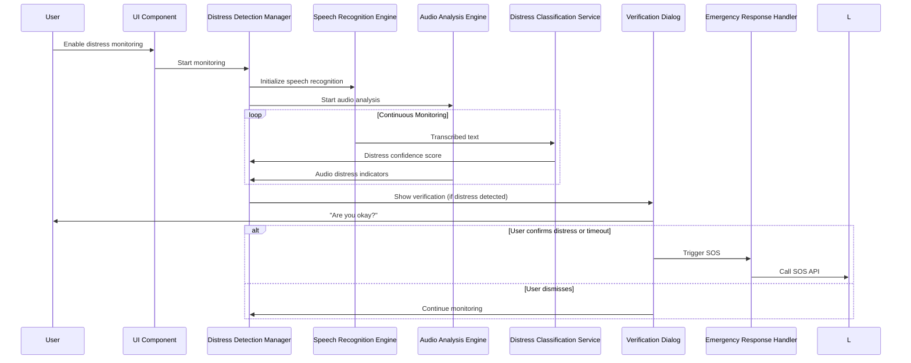

# AI-Powered Audio & Speech Distress Detection System - Design

## Overview

The AI-powered distress detection system integrates seamlessly into the existing GuardianLink React PWA, adding intelligent audio monitoring capabilities. The system uses a multi-layered approach combining Web Speech API for speech recognition, Web Audio API for audio analysis, and AI/NLP services for distress classification. The design prioritizes privacy, performance, and reliability while minimizing false positives.

## Architecture

### High-Level Architecture



### Component Interaction Flow



## Components and Interfaces

### 1. Distress Detection Manager

**Purpose**: Central coordinator for all distress detection activities

**Key Methods**:
```typescript
interface DistressDetectionManager {
  startMonitoring(): Promise<void>;
  stopMonitoring(): void;
  updateSettings(settings: DistressSettings): void;
  handleDistressDetected(source: 'speech' | 'audio', confidence: number): void;
}
```

**Responsibilities**:
- Coordinate between speech recognition and audio analysis
- Manage detection state and settings
- Trigger verification dialogs
- Handle emergency response activation

### 2. Speech Recognition Engine

**Purpose**: Convert speech to text and manage continuous listening

**Key Methods**:
```typescript
interface SpeechRecognitionEngine {
  initialize(): Promise<void>;
  startListening(): void;
  stopListening(): void;
  onResult(callback: (transcript: string) => void): void;
  onError(callback: (error: Error) => void): void;
}
```

**Implementation Details**:
- Uses Web Speech API with continuous mode
- Implements noise filtering and confidence thresholds
- Handles browser compatibility and fallbacks
- Manages automatic restart on errors

### 3. Audio Analysis Engine

**Purpose**: Analyze raw audio for distress indicators

**Key Methods**:
```typescript
interface AudioAnalysisEngine {
  initialize(): Promise<void>;
  startAnalysis(): void;
  stopAnalysis(): void;
  onDistressDetected(callback: (confidence: number) => void): void;
}
```

**Implementation Details**:
- Uses Web Audio API for real-time analysis
- Implements FFT analysis for frequency patterns
- Detects volume spikes and sudden changes
- Analyzes audio characteristics for distress patterns

### 4. Distress Classification Service

**Purpose**: Analyze text for distress-related content

**Key Methods**:
```typescript
interface DistressClassificationService {
  analyzeText(text: string): Promise<DistressAnalysis>;
  setProcessingMode(mode: 'local' | 'api'): void;
}

interface DistressAnalysis {
  isDistress: boolean;
  confidence: number;
  detectedPhrases: string[];
  sentiment: 'positive' | 'negative' | 'neutral';
}
```

**Local Processing Implementation**:
- Regex patterns for common distress phrases
- Word embedding similarity matching
- Sentiment analysis using compromise.js
- Configurable phrase dictionary

**API Processing Implementation**:
- Hugging Face Inference API integration
- DistilBERT model for sentiment classification
- Whisper model for enhanced speech processing
- Rate limiting and error handling

### 5. Verification Dialog Component

**Purpose**: User interface for distress confirmation

**Key Methods**:
```typescript
interface VerificationDialog {
  show(detectionSource: string, confidence: number): Promise<VerificationResult>;
  hide(): void;
}

interface VerificationResult {
  action: 'confirm' | 'dismiss' | 'timeout';
  timestamp: Date;
}
```

**UI Design**:
- Modal overlay with high z-index
- Clear, urgent messaging
- Large, accessible buttons
- 10-second countdown timer
- Audio/visual alerts

### 6. Emergency Response Handler

**Purpose**: Manage SOS activation and emergency protocols

**Key Methods**:
```typescript
interface EmergencyResponseHandler {
  triggerSOS(context: DistressContext): Promise<void>;
  logDistressEvent(event: DistressEvent): void;
}

interface DistressContext {
  detectionMethod: 'speech' | 'audio' | 'combined';
  confidence: number;
  timestamp: Date;
  audioData?: Blob;
  transcript?: string;
}
```

## Data Models

### Distress Settings

```typescript
interface DistressSettings {
  enabled: boolean;
  speechRecognition: {
    enabled: boolean;
    sensitivity: number; // 0-100
    language: string;
    continuousMode: boolean;
  };
  audioAnalysis: {
    enabled: boolean;
    volumeThreshold: number; // dB
    spikeDetection: boolean;
    frequencyAnalysis: boolean;
  };
  nlpProcessing: {
    mode: 'local' | 'api';
    confidenceThreshold: number; // 0-100
    customPhrases: string[];
  };
  verification: {
    timeoutSeconds: number;
    showCountdown: boolean;
    requireExplicitConfirmation: boolean;
  };
  privacy: {
    storeAudioLocally: boolean;
    sendToAPI: boolean;
    dataRetentionDays: number;
  };
}
```

### Distress Event Log

```typescript
interface DistressEvent {
  id: string;
  timestamp: Date;
  detectionMethod: 'speech' | 'audio' | 'combined';
  confidence: number;
  transcript?: string;
  audioMetrics?: {
    peakVolume: number;
    duration: number;
    frequencyProfile: number[];
  };
  userResponse: 'confirmed' | 'dismissed' | 'timeout';
  sosTriggered: boolean;
  location?: {
    latitude: number;
    longitude: number;
    accuracy: number;
  };
}
```

## Error Handling

### Speech Recognition Errors
- **No microphone access**: Graceful degradation with user notification
- **Browser compatibility**: Fallback to manual SOS activation
- **Network issues**: Continue with local processing only
- **Recognition failures**: Automatic restart with exponential backoff

### Audio Analysis Errors
- **Web Audio API unavailable**: Disable audio analysis, continue with speech only
- **Processing overload**: Reduce analysis frequency temporarily
- **Memory constraints**: Implement buffer management and cleanup

### AI Service Errors
- **API rate limits**: Fall back to local processing
- **Network timeouts**: Queue requests for retry
- **Authentication failures**: Notify user and disable API features
- **Model unavailable**: Use backup classification methods

## Testing Strategy

### Unit Testing
- **Speech Recognition Engine**: Mock Web Speech API responses
- **Audio Analysis Engine**: Test with synthetic audio patterns
- **Distress Classification**: Test with known distress/non-distress phrases
- **Verification Dialog**: Test timeout and user interaction scenarios

### Integration Testing
- **End-to-end distress detection flow**: Simulate real distress scenarios
- **Cross-browser compatibility**: Test on Chrome, Firefox, Safari, Edge
- **Mobile device testing**: Test on iOS and Android devices
- **Performance testing**: Monitor CPU and memory usage during continuous monitoring

### User Acceptance Testing
- **False positive rate**: Measure and minimize false alarms
- **Detection accuracy**: Test with various speech patterns and accents
- **Response time**: Ensure sub-second detection and verification display
- **Accessibility**: Test with screen readers and keyboard navigation

### Privacy and Security Testing
- **Data handling**: Verify no unauthorized data transmission
- **Permission management**: Test microphone access controls
- **Local storage**: Verify secure handling of audio data
- **API security**: Test authentication and data encryption

## Performance Considerations

### Frontend Optimization
- **Web Workers**: Offload audio processing to prevent UI blocking
- **Memory Management**: Implement circular buffers for audio data
- **Battery Usage**: Optimize processing frequency for mobile devices
- **Lazy Loading**: Load AI models only when needed

### Backend Integration
- **API Caching**: Cache AI model responses for common phrases
- **Rate Limiting**: Implement client-side rate limiting for API calls
- **Batch Processing**: Group multiple detection events for efficiency
- **Error Recovery**: Implement robust retry mechanisms

## Security and Privacy

### Data Protection
- **Local Processing**: Default to local-only processing when possible
- **Encryption**: Encrypt any stored audio data
- **Data Minimization**: Store only essential detection metadata
- **User Consent**: Explicit opt-in for cloud processing

### Access Control
- **Permission Management**: Granular microphone access controls
- **Session Management**: Secure handling of API tokens
- **Audit Logging**: Log all distress detection events securely
- **Data Retention**: Automatic cleanup of old detection data

## Deployment Considerations

### Browser Compatibility
- **Web Speech API**: Chrome 25+, Firefox 44+, Safari 14.1+
- **Web Audio API**: Universal support in modern browsers
- **Fallback Strategies**: Manual SOS for unsupported browsers

### Mobile Considerations
- **PWA Integration**: Ensure background processing capabilities
- **Battery Optimization**: Implement intelligent monitoring schedules
- **Network Awareness**: Adapt processing based on connection quality
- **Device Permissions**: Handle iOS/Android permission models

### Monitoring and Analytics
- **Detection Metrics**: Track accuracy and false positive rates
- **Performance Monitoring**: Monitor processing latency and resource usage
- **User Engagement**: Track feature adoption and usage patterns
- **Error Tracking**: Comprehensive error logging and alerting